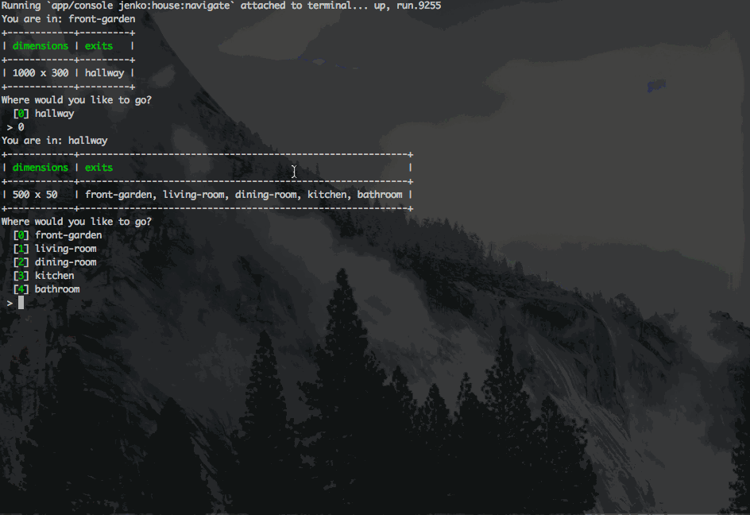

DDD House
=========

This repository is used to 'build a house with DDD'. It's a means of getting my head around a few concepts I've been learning recently. Such as the following:

* [Modelling by example](http://everzet.com/post/99045129766/introducing-modelling-by-example)
* [Domain-Driven-Design](http://en.wikipedia.org/wiki/Domain-driven_design)
* Commands and Handlers
* Command Bus
* Domain Events
* [Hexagonal Architecture](http://alistair.cockburn.us/Hexagonal+architecture)
* BDD (using Behat & PHPSpec)
* [Named constructors](http://verraes.net/2014/06/named-constructors-in-php/)
* [Value Objects](http://verraes.net/2014/06/named-constructors-in-php/)

The biggest thing I aim to achieve is the separation of layers. Using modelling by example to work from the middle out. Cleanly separating the domain from the rest of the application. 

I aim to do this iteratively with each stage of my work in a separate branch. For example, version1 branch may be just setting up some basic behat features through to a fully featured domain layer, with infrastructure supporting a front end that communicates to the domain.

How to use this repo
--------------------

View each branch along with the notes in the commit message to see what each commit adds.

* [Version0](https://github.com/jenkoian/ddd-house/commit/ba1160626505e1f3a5df963bfa974178e6fc391d)
* [Version1](https://github.com/jenkoian/ddd-house/commit/f5a95111f479785454cf6cf5b765ca20cb61475b)
* [Version2](https://github.com/jenkoian/ddd-house/commit/f3fc5150db91a0ad1be9d56eb8b0af72a48f0026)
* [Version3](https://github.com/jenkoian/ddd-house/commit/9abb0ec5c8d7918537ba84ed28b999798414aab4)
* [Version4](https://github.com/jenkoian/ddd-house/commit/5661411bc0a6f5a0b942f9922150b045709be1c3)
* [Version5](https://github.com/jenkoian/ddd-house/commit/3dab522b244512d6fbfad70d27d947819d9c16b2)
* [Version6](https://github.com/jenkoian/ddd-house/commit/bc7dc0840e634ab22475aee1d5b97a7ad5221427)
* [Version7](https://github.com/jenkoian/ddd-house/commit/f68fd0975ead6a6a1177732491ed3d29ba021880)
* [Version8](https://github.com/jenkoian/ddd-house/commit/d125b4a7f5e2ab55ce0910c7c4bd1d240d336f68)
* [Version9](https://github.com/jenkoian/ddd-house/commit/1cd52fe156bfd5a93118aac5348988d08142d028)
* [Version10](https://github.com/jenkoian/ddd-house/commit/56319d09ada9b9a08fe682d697a3973bf36d6bb2)
* [Version11](https://github.com/jenkoian/ddd-house/commit/a81431f281b154644c0f899afb64ace67b74d50d)
* [Version12](https://github.com/jenkoian/ddd-house/commit/802936f09a1c85c06c7b5b572f45d4e76b0b6b69)
* [Version13](https://github.com/jenkoian/ddd-house/commit/50fce972753cab2f914a4569762bb4ba99d25b35)
* [Version14](https://github.com/jenkoian/ddd-house/commit/2712efbf1e3719b0295c3cc547176ad405beb262)
* [Version15](https://github.com/jenkoian/ddd-house/commit/83cbbd8651af8514211d0c6198b9512e10cb5211)
* [Version16](https://github.com/jenkoian/ddd-house/commit/2355c7582e8260d7cb03401bfad48fcc30174fe6)
* [Version17](https://github.com/jenkoian/ddd-house/commit/60f9b70ab227785a5e503a4ed88c7da01d98adc9)
* [Version18](https://github.com/jenkoian/ddd-house/commit/e4ace656623d57cb78b6c8e5dc9b870b33ef4186)
* [Version19](https://github.com/jenkoian/ddd-house/commit/0952bb45115bb90786b0b685a0ce04de41cf7091)
* [Version20](https://github.com/jenkoian/ddd-house/commit/b8ebbea1bf200e399661f252acc4aee9ff7d2da9)
* [Version21](https://github.com/jenkoian/ddd-house/commit/73bb68c1d9fe6a9d125191b3e535af3fb1165c09)
* [Version22](https://github.com/jenkoian/ddd-house/commit/2c2ec90ebf0d55b5bf30366df99a1dfd31e14077)
* [Version23](https://github.com/jenkoian/ddd-house/commit/dcb675d273260b6a9e0af7948a26945ca2605a01)
* [Version24](https://github.com/jenkoian/ddd-house/commit/4fdc5ed94368ef1656ea80e6fde634a58020cc04)
* [Version25](https://github.com/jenkoian/ddd-house/commit/a9ca03a9d882cf03d1e8ca48f17f9780a62ec1f5)

Demo app
--------

The demo app is viewable at [https://dddhouse.herokuapp.com/](https://dddhouse.herokuapp.com/)

CLI app
-------

A gif of the CLI version in action:

Inspiration
-----------

As mentioned the blog post by Everzet on ['Modelling by example'](http://everzet.com/post/99045129766/introducing-modelling-by-example) was a big inspiration behind this kind of approach. Definitely read it. Funnily enough, he has been working on a similar repository which I wasn't aware of until recently called ['pick-my-talks'](https://github.com/MarcelloDuarte/pick-my-talks). It doesn't cover things like commands and handler but is probably a better example of modelling by exmaple than this, so definitely recommend checking that out also.

Other sources of inspiration include:

* This excellent talk by Ross Tuck: [Models and Service Layers](https://www.youtube.com/watch?v=ajhqScWECMo)

TODO
----

* Add acceptance tests as a next step.
* Look into possibility of adding some kind of persistence of house state.

